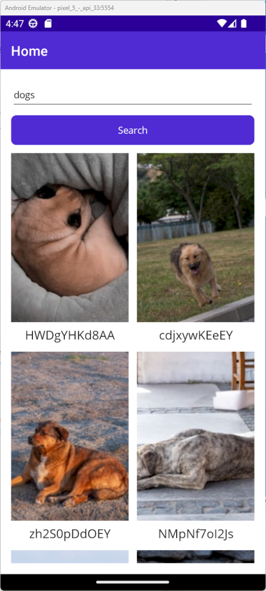
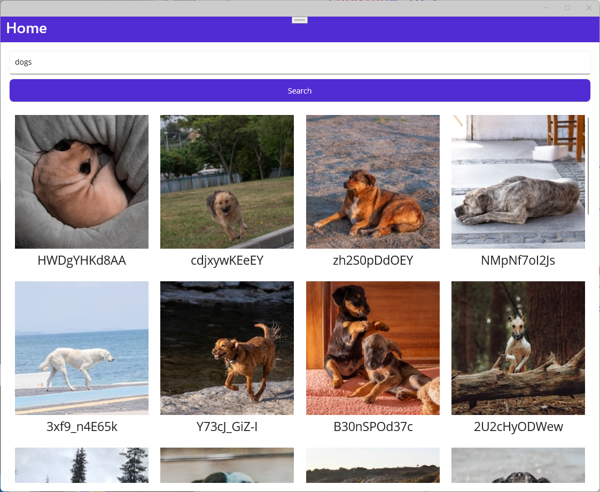

# UnsplashSharp

A .NET client wrapper for https://unsplash.com written in .NET Standard 2.0


## Installation

Install the package via [NuGet](https://www.nuget.org/packages/UnsplashSharp).

<a href="https://www.nuget.org/packages/UnsplashSharp" target="_blank"></a>


## Usage

First you need to get a free API key from [unsplash.com](https://www.unsplash.com). You can create a new account and navigate to the [Unsplash Developer Portal](https://unsplash.com/developers). Here you can create a new [application](https://unsplash.com/oauth/applications) and you will find your API key.

You need to create a new instance of `UnsplashpService` passing in the *API key*. There is also an interface available, if you are using Dependency Injection.

```csharp
/// <summary>
///     The application ID provided by Unsplash.
/// </summary>
string ApplicationId { get; }

/// <summary>
///     The maximum request limit for the client.
/// </summary>
int MaxRateLimit { get; }

/// <summary>
///     The number of remaining requests the client can make.
/// </summary>
int RateLimitRemaining { get; }

/// <summary>
///     Get a list of photo collections.
/// </summary>
Task<Collection> GetCollectionAsync(
    string id);

/// <summary>
///     Get a single photo collection.
/// </summary>
Task<List<Collection>> GetCollectionsAsync(
    int page = 1, 
    int perPage = 10);

/// <summary>
///     Get a list of photos from a specific collection.
/// </summary>
Task<List<Photo>> GetPhotosOfCollectionAsync(
    string id, 
    int page = 1, 
    int perPage = 10, 
    Orientation orientation = Orientation.All);

/// <summary>
///     Gets a list of collections related to a specific collection.
/// </summary>
Task<List<Collection>> GetRelatedCollectionsAsync(
    string id);


/// <summary>
///     Retrieves the total statistics object from Unsplash.
/// </summary>
Task<TotalStats> GetTotalStatsAsync();

/// <summary>
///     Retrieves the monthly statistics object from Unsplash.
/// </summary>
Task<MonthlyStats> GetMonthlyStatsAsync();


/// <summary>
///     Gets a single photo.
/// </summary>
Task<Photo> GetPhotoAsync(
    string id);

/// <summary>
///     Gets a list of random photos.
/// </summary>
Task<List<Photo>> GetRandomPhotosAsync(
    int count = 1, 
    string[] collections = null, 
    string[] topics = null, 
    string username = "", 
    string query = "", 
    Orientation orientation = Orientation.All, 
    ContentFilter contentFilter = ContentFilter.Low);

/// <summary>
///     Gets statistics for a specific photo.
/// </summary>
Task<PhotoStats> GetPhotoStatsAsync(
    string id, 
    int quantity = 30);

/// <summary>
///     Gets a download link for a specific photo.
/// </summary>
Task<string> GetPhotoDownloadLinkAsync(
    string id);

/// <summary>
///     Gets a list of photos.
/// </summary>
Task<List<Photo>> GetPhotosAsync(
    int page = 1, 
    int perPage = 10, 
    PhotoOrderBy orderBy = PhotoOrderBy.Latest);


/// <summary>
///     Searches for photos on Unsplash based on the given query string and search parameters.
/// </summary>
Task<List<Photo>> SearchPhotosAsync(
    string query, 
    int page = 1, 
    int perPage = 10, 
    PhotoOrderBy orderBy = PhotoOrderBy.Latest, 
    string[] collectionIds = null, 
    ContentFilter contentFilter = ContentFilter.Low, 
    UnsplashColor color = UnsplashColor.All, 
    Orientation orientation = Orientation.All);

/// <summary>
///     Searches for collections on Unsplash based on the given query string and search parameters. 
/// </summary>
Task<List<Collection>> SearchCollectionsAsync(
    string query, 
    int page = 1, 
    int perPage = 10);

/// <summary>
/// Searches for users on Unsplash based on the given query string and search parameters.
/// </summary>
Task<List<User>> SearchUsersAsync(
    string query, 
    int page = 1, 
    int perPage = 10);


/// <summary>
///     Retrieves a list of topics from Unsplash, filtered by ID and sorted by position, with pagination.
/// </summary>
Task<List<Topic>> GetTopicsAsync(
    string[] ids = null, 
    int page = 1, 
    int perPage = 10, 
    TopicOrderBy orderBy = TopicOrderBy.Position);

/// <summary>
///     Retrieves a topic from Unsplash by ID.
/// </summary>
Task<Topic> GetTopicAsync(
    string id);

/// <summary>
///     Retrieves a list of photos from Unsplash related to a given topic ID.
/// </summary>
Task<List<Photo>> GetPhotosOfTopicAsync(
    string id, 
    int page = 1, 
    int perPage = 10, 
    Orientation orientation = Orientation.All, 
    PhotoOrderBy orderBy = PhotoOrderBy.Latest);


/// <summary>
///     Retrieves a user object from Unsplash by username.
/// </summary>
Task<User> GetUserAsync(
    string username);

/// <summary>
///     Retrieves the portfolio link of a user with the specified username.
/// </summary>
Task<string> GetUserPorfolioLinkAsync(
    string username);

/// <summary>
///     Retrieves a list of photos uploaded by a user with the specified username. 
/// </summary>
Task<List<Photo>> GetUserPhotosAsync(
    string username, 
    int page = 1, 
    int perPage = 10, 
    PhotoOrderBy orderBy = PhotoOrderBy.Latest, 
    bool stats = false, 
    int quantity = 30, 
    Orientation orientation = Orientation.All);

/// <summary>
///     Retrieves a list of photos liked by a user with the specified username.
/// </summary>
Task<List<Photo>> GetUserLikedPhotosAsync(
    string username, 
    int page = 1, 
    int perPage = 10, 
    PhotoOrderBy orderBy = PhotoOrderBy.Latest, 
    Orientation orientation = Orientation.All);

/// <summary>
///     Retrieves a list of collections created by a user with the specified username.
/// </summary>
Task<List<Collection>> GetUserCollectionsAsync(
    string username, 
    int page = 1, 
    int perPage = 10);

/// <summary>
///     Retrieves statistics for a user with the specified username.
/// </summary>
Task<UserStats> GetUserStatsAsync(
    string username, 
    int quantity = 30);
```


## Sample

Here are screenshots of a `.NET MAUI application` using the [NuGet package](https://www.nuget.org/packages/UnsplashSharp) to get some images.

### Android



### Windows




## Buy Me A Coffee

I appreciate any form of support to keep my _Open Source_ activities going.

Whatever you decide, be it reading and sharing my blog posts, using my NuGet packages or buying me a coffee/book, thank you ❤️.

<a href="https://www.buymeacoffee.com/tsjdevapps" target="_blank"></a>


## Contributing

Pull requests are welcome. For major changes, please open an issue first
to discuss what you would like to change.

Please make sure to update tests as appropriate.


## License

[MIT](https://choosealicense.com/licenses/mit/)